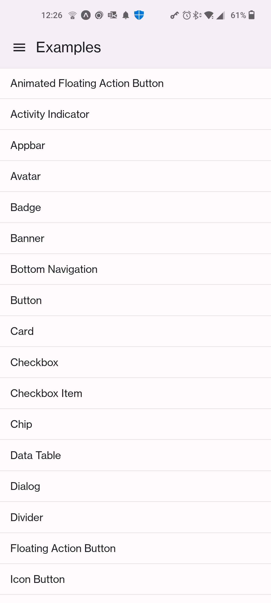
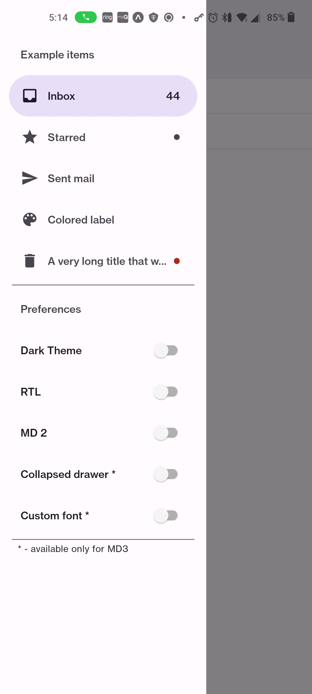
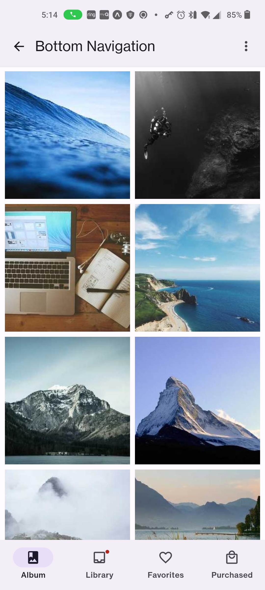

# React Native PaperExample
I created this since [callstack's GitHub repo](https://github.com/callstack/react-native-paper) did not run on machine just when I followed their [instructions](https://callstack.github.io/react-native-paper/index.html).

I have fixed the errors that pervented callstack's GitHub project from working.

Examples taken from [React Native Paper examples](https://github.com/callstack/react-native-paper/tree/main/example)

I added 2 more of my own
- FlatListImagesExample
- MaterialBottomTabsExample

# Screen shots
Main Screen | Drawer | Flatlist Images
:-----------:|:-----------:|:-----------: |
 |  |  | !

Bottom Navigation | Material Bottom Tabs | &nbsp;
:-----------:|:-----------:|:-----------:
 |  | <span>&nbsp;&nbsp;&nbsp;&nbsp;&nbsp;&nbsp;&nbsp;&nbsp;&nbsp;&nbsp;&nbsp;&nbsp;&nbsp;&nbsp;&nbsp;&nbsp;&nbsp;&nbsp;&nbsp;&nbsp;&nbsp;&nbsp;&nbsp;&nbsp;&nbsp;&nbsp;&nbsp;&nbsp;&nbsp;&nbsp;&nbsp;&nbsp;&nbsp;&nbsp;&nbsp;&nbsp;&nbsp;&nbsp;&nbsp;&nbsp;&nbsp;</span>

## Prerequisites

- [Node.js > 12](https://nodejs.org) 
- [nvm](https://github.com/nvm-sh/nvm)
- [yarn](https://classic.yarnpkg.com/)
- [Watchman](https://facebook.github.io/watchman)
- [Android Studio and Android SDK](https://developer.android.com/studio)
- [React Native Expo Go](https://reactnative.dev/docs/environment-setup)
  
# Run this repo
- Open Administrator nodejs command window
- run following
```Shell
# Goto parent folder (ie where you store your code)
cd <parent folder>

# Download this repo [paperexample](https://github.com/huttonjd/paperexample)
git clone https://github.com/huttonjd/paperexample

# cd into repo
cd paperexample
 
# To install needed packages run
yarn install

# On your cell install __Expo Go__ from Google play or Apple Store
# NOTE: Your cellphone has to be on same network as you machine
# To run repo use one of the following
npm start
# or
expo start -c

# run code on cell by scanning barcode 
# Andriod: __Expo Go__ option
# Apple: Use camera app and select link when it comes up
```

# Runs on
NodeJs - Windows 18.12.1

chocolatey - 1.2.1

Andriod Studio - Dolphin 2021.3.1 patch 1

# Step to create this repo from scratch
## Open nodejs command prompt 
- open Administrator __nodejs__ command prompt
- cd < parent location to store code >
## Create App 
- npx create-expo-app paperexample
- cd paperexample

## Add Modules needed to run
```Shell
yarn add @expo/vector-icons
yarn add @react-native-async-storage/async-storage
yarn add @react-native-community/masked-view
yarn add @react-navigation/bottom-tabs
yarn add @react-navigation/drawer
yarn add @react-navigation/elements
yarn add @react-navigation/material-bottom-tabs
yarn add @react-navigation/material-top-tabs
yarn add @react-navigation/native
yarn add @react-navigation/native-stack
yarn add @react-navigation/stack
yarn add expo
yarn add expo-status-bar
yarn add react
yarn add react-native
yarn add react-native-gesture-handler
yarn add react-native-pager-view
yarn add react-native-paper
yarn add react-native-reanimated
yarn add react-native-safe-area-context
yarn add react-native-screens
yarn add react-native-tab-view
yarn add react-navigation
```
## Update .\App.js 
- open .\App.js
- Replace it with following and save
```javascript
import * as React from 'react';
import { AppRegistry } from 'react-native';
import { Provider as PaperProvider } from 'react-native-paper';
import { name as appName } from './app.json';
import MainMenu from './src/index';

export default function Main() {
  return (
    <PaperProvider>
      <MainMenu />
    </PaperProvider>
  );
}

AppRegistry.registerComponent(appName, () => Main);
```

## update bable.config.js
- open .\bable.config.js
- - replace it with the following and save
```javascript
module.exports = function(api) {
  api.cache(true);
  return {
    presets: ['babel-preset-expo'],
    plugins: ['react-native-paper/babel', 'react-native-reanimated/plugin'],
  };
};
```
## Copy src & util folder from this repo

# To run
npm start
or
expo start -c
